# 🎨 Setting Bandwith Internet pada Mikrotik

Pastikan sudah melakukan setting atau konfigurasi dasar mikrotik secara tepat dan selesai. Jika sudah terpenuhi, maka bisa melanjutkan pembacaan ini.

## 1️⃣ DHCP SERVER LEASES

Pastikan semua IP address yang tersambung ke dalam Leases ini dibuat secara static, dengan cara klik kanan pada IP Address lalu pilih `Make Static`. Pakai comment untuk memberikan text atau menandai Nama Router-nya.

## 2️⃣ PEMBAGIAN TRAFFIC BANDWITH

Berikut adalah hasil pembagian Bandwith Internet pada Simple Queues.

Anggap saja, memiliki Internet 60Mbps dan akan dibagi sebanyak 5 rumah dan 1 PC.

## 3️⃣ BUAT PARENT TRAFFIC

Untuk pembagian bandwith, perlu membuat parent-nya dimana IP Address yang dimasukkan sesuai port ethernet pada mikrotik-nya.

Sebagai contoh, untuk traffic rumah-rumah sudah pasti menggunakan port ether3 dimana memiliki IP Address `192.168.20.1/24` dan traffic PC menggunakan port ether2 yang memiliki IP Address `192.168.10.1/24`.

Gunakan network untuk kedua IP Address tersebut, maka yang perlu ditulis adalah `192.168.10.0/24` dan `192.168.20.0/24`

### 1️⃣ All Traffic General

Berikut gambaran untuk setting All Traffic pada tab General.

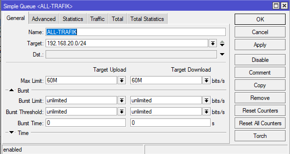

### 2️⃣ All Traffic Advanced

Berikut gambaran untuk setting All Traffic pada tab Advanced.

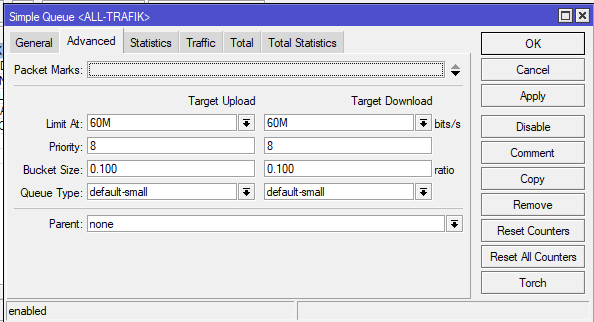

### 3️⃣ PC Traffic General

Berikut gambaran untuk setting PC Traffic pada tab General.

### 4️⃣ PC Traffic Advanced

Berikut gambaran untuk setting PC Traffic pada tab Advanced.

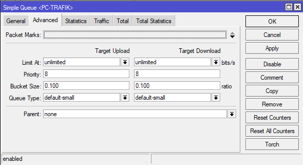

Setelah membuat parent traffic pada masing-masing network, langkah selanjutnya adalah membuat child traffic nya dimana nanti-nya akan diisi oleh IP Address masing-masing device rumah yang telah dibuat static sebelum-nya.

## 4️⃣ BUAT CHILD TRAFFIC

Masing-masing Parent traffic memiliki Child-nya. Untuk Parent Traffic dengan network `192.168.20.0/24` memiliki child sebanyak 5 device yaitu 5 rumah. Maka dari itu, perlu untuk setting masing-masing device tersebut.

### 1️⃣ Rumah Ardian General

Berikut gambaran untuk setting Rumah Ardian pada tab General.

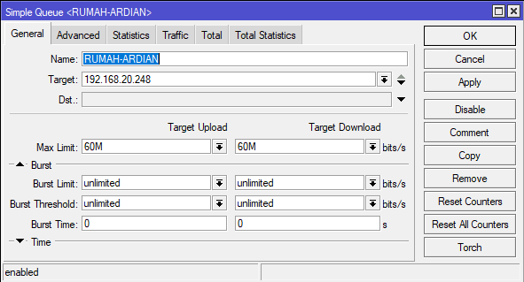

### 2️⃣ Rumah Ardian Advanced

Berikut gambaran untuk setting Rumah Ardian pada tab Advanced.

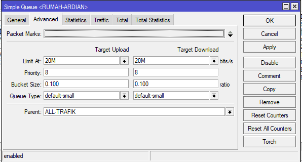

Untuk Rumah Ardian, di limit internet-nya sampai 20MB.

### 3️⃣ Rumah Windi General

Berikut gambaran untuk setting Rumah Windi pada tab General.

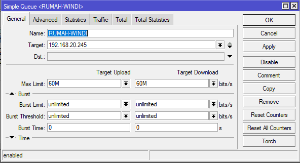

### 4️⃣ Rumah Windi Advanced

Berikut gambaran untuk setting Rumah Windi pada tab Advanced.

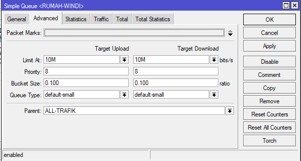

Untuk Rumah Windi, di limit internet-nya sampai 10MB.

### 5️⃣ Rumah Lala General

Berikut gambaran untuk setting Rumah Lala pada tab General.

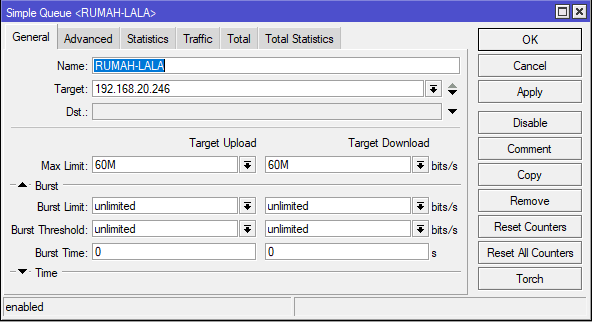

### 6️⃣ Rumah Lala Advanced

Berikut gambaran untuk setting Rumah Lala pada tab Advanced.

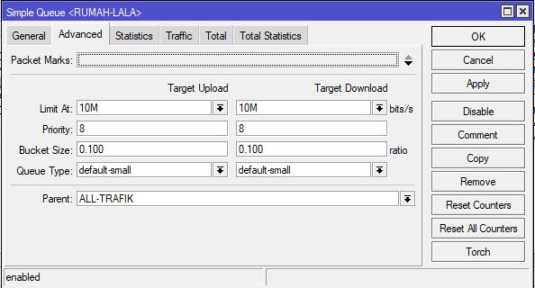

Untuk Rumah Lala, di limit internet-nya sampai 10MB.

### 7️⃣ Rumah Utama General

Berikut gambaran untuk setting Rumah Utama pada tab General.

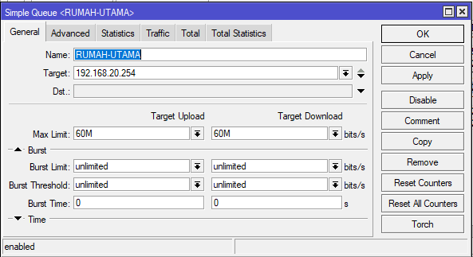

### 8️⃣ Rumah Utama Advanced

Berikut gambaran untuk setting Rumah Utama pada tab Advanced.

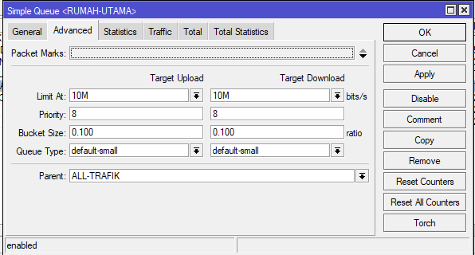

Untuk Rumah Utama, di limit internet-nya sampai 10MB.

### 9️⃣ Rumah Taqim General

Berikut gambaran untuk setting Rumah Taqim pada tab General.

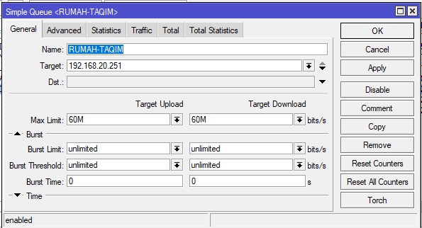

### 🔟 Rumah Taqim Advanced

Berikut gambaran untuk setting Rumah Taqim pada tab Advanced.

Untuk Rumah Taqim, di limit internet-nya sampai 10MB.

### 1️⃣1️⃣ PC Utama General

Berikut gambaran untuk setting PC Utama pada tab General.

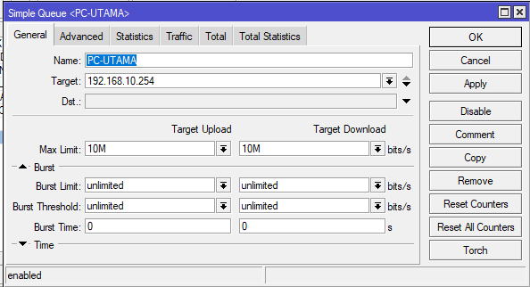

### 1️⃣2️⃣ PC Utama Advanced

Berikut gambaran untuk setting PC Utama pada tab Advanced.

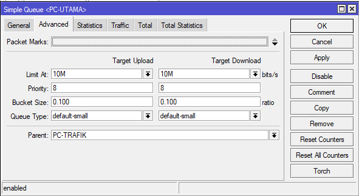

Untuk PC Utama, di limit internet-nya sampai 10MB.

Setelah semua Child Traffic ter-konfigurasi, maka yang itu sudah selesai. Selamat telah menyelesaikan setting traffic bandwith mikrotik.