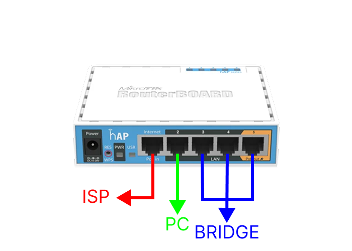

# 📚 DOKUMENTASI SETTING MIKROTIK DASAR

> Studi kasus : Fahri Network

Dokumen ini dibuat sebagai <b>pengingat</b> untuk settingan mikrotik dari nol. Cocok dipelajari oleh pemula yang ingin settingan tanpa basa basi.

## 🎯 Tujuan Akhir

Mikrotik berfungsi sebagai :

- Gateway utama ke Internet (ISP)
- Pembagi internet ke beberapa rumah
- Setiap rumah punya router & subnet sendiri

## 📋 Topologi

1. <b>Ether1</b> : Untuk ISP (Sumber internet)
2. <b>Ether2</b> : Untuk PC (Bisa untuk setting mikrotik)
3. <b>Ether3-5</b> : Untuk Client (Bridge)

Subnet yang digunakan sesuai Topologi Fahri Network.

- ISP (WAN) : `192.168.18.0/24`
- Local LAN (PC) : `192.168.10.0/24`
- Distribusi Rumah (Bridge) : `192.168.20.0/24`

## 🔌 Pembagian Port Mikrotik

| Port  | Nama Interface  | Fungsi  |
|:---:|:---:|---|
| ether1  | ISP  | Ke router ISP  |
| ether2  | PC  | PC / Laptop konfigurasi  |
| ether3  | DIST_1  | Ke Switch  |
| ether4  | DIST_2  | Ke Switch  |
| ether5  | DIST_3  | Ke Switch  |

## 🔴 WAJIB DILAKUKAN

Sebelum melakukan konfigurasi, alangkah baik-nya mikrotik direset terlebih dahulu, untuk riset ada 2 cara yaitu soft riset dan hard riset.

Untuk soft riset bisa lakukan langkah berikut ini :

### 1️⃣ Soft Riset Mikrotik

Menu : <b>System</b> ➡ <b>Reset Configuration</b>

Tunggulah sejenak sampai mendengar bunyi bip 2x dari mikrotik-nya. 

### 2️⃣ Hard Riset Mikrotik

Untuk melakukan Hard Riset, perlu menocolok (tergantung seri mikrotik) lubang riset di mikrotik-nya secara langsung, biasanya ditahan sampai 1-3 menit sampai muncul bunyi bib 2x seperti halnya ketika soft riset.

## ✅ Kondisi Awal

- Pastikan Mikrotik sudah di reset bersih.
- Login via winbox (Mac Address)
- User : `admin`
- Password : (kosong)
- Klik `Remove Configurations` untuk menghilangkan konfigurasi bawaan pabrik. (Ini akan me-restart mikrotik beberapa saat dan tunggulah sejenak)

Setelah semua-nya sudah selesai, sekarang lanjut konfigurasi awal mikrotik sampai selesai.

## 1️⃣ UBAH NAMA INTERFACE (WAJIB)

Menu: <b>Interfaces</b>

Rename:

- ether1 ➡ `ISP`
- ether2 ➡ `PC`
- ether3 ➡ `DIST_1`
- ether4 ➡ `DIST_2`
- ether5 ➡ `DIST_3`

## 2️⃣ BUAT BRIDGE

Menu: <b>Bridge</b> ➡ <b>Bridge</b> ➡ <b>➕</b>

pada tab General, berikut settingan-nya :

- Name : `BRIDGE-DIST`
- Apply --> OK

Masukkan ether3-ether5 ke dalam `BRIDGE-DIST`

Menu: <b>Bridge</b> ➡ <b>Ports</b> ➡ <b>➕</b>

pada tab General, berikut settingan-nya :

1. <b>ether3</b>

- Interface : `DIST_1`
- Bridge : `BRIDGE-DIST`
- Apply --> OK

2. <b>ether4</b>

- Interface : `DIST_2`
- Bridge : `BRIDGE-DIST`
- Apply --> OK

2. <b>ether5</b>

- Interface : `DIST_3`
- Bridge : `BRIDGE-DIST`
- Apply --> OK

## 3️⃣ SETTING WAN (INTERNET DARI ISP)

Menu: <b>IP</b> ➡ <b>DHCP Client</b> ➡ <b>➕</b>

pada tab DHCP, berikut settingan-nya :

- Interface : `ISP`
- Use Peer DNS ✅
- Use Peer NTP ✅
- Add Default Route : yes
- Apply --> OK

Tunggu sampai status `bound`. Jika sudah `bound` maka `ISP` berhasil mengalirkan internet ke Mikrotik.

## 4️⃣ SETTING DNS

Menu: <b>IP</b> ➡ <b>DNS</b>

- Servers : `8.8.8.8` dan `8.8.4.4`
- Allow Remote Requests ✅
- Apply --> OK

## 5️⃣ SETTING IP

Sesuai dengan port-nya masing-masing, maka perlu setting IP untuk PC dan Bridge.

### 💻 Setting IP untuk PC

Menu: <b>IP</b> ➡ <b>Addresses</b> ➡ <b>➕</b>

- Address : `192.168.10.1/24`
- Network : `192.168.10.0`
- Interface : `PC`

### 🔌 Setting IP untuk Bridge

Menu: <b>IP</b> ➡ <b>Addresses</b> ➡ <b>➕</b>

- Address : `192.168.20.1/24`
- Network : `192.168.20.0`
- Interface : `BRIDGE-DIST`

## 6️⃣ SETTING DHCP SERVER

Agar IP dapat dibagikan secara DHCP kepada setiap PC dan masing-masing Router Rumah, maka perlu konfigurasi DHCP Server. Sesuai dengan IP masing-masing PC dan Bridge.

### 💻 Setting DHCP Server untuk PC

Menu: <b>IP</b> ➡ <b>DHCP Server</b> ➡ <b>DHCP Setup</b>

Berikut konfigurasi-nya :

- DHCP Server Interface : `PC`
- DCHP Address Space : `192.168.10.0/24`
- Gateway for DHCP Network : `192.168.10.1`
- Addresses to Give Out : `192.168.10.2-192.168.10.254`
- DNS Servers : `192.168.18.1`
- Leases Time : `00:10:00`

### 🔌 Setting DHCP Server untuk Bridge

Menu: <b>IP</b> ➡ <b>DHCP Server</b> ➡ <b>DHCP Setup</b>

Berikut konfigurasi-nya :

- DHCP Server Interface : `BRIDGE-DIST`
- DCHP Address Space : `192.168.20.0/24`
- Gateway for DHCP Network : `192.168.20.1`
- Addresses to Give Out : `192.168.20.2-192.168.20.254`
- DNS Servers : `192.168.18.1`
- Leases Time : `00:10:00`

## 7️⃣ SETTING NAT (AGAR INTERNET JALAN)

Menu: <b>IP</b> ➡ <b>Firewall</b> ➡ <b>NAT</b> ➡ <b>➕</b>

pada tab General, berikut settingan-nya :

- Chain : `srcnat`
- Out. Interface : `ISP`

pada tab Action, berikut settingan-nya :

- Action : `masquerade`
- Apply --> OK